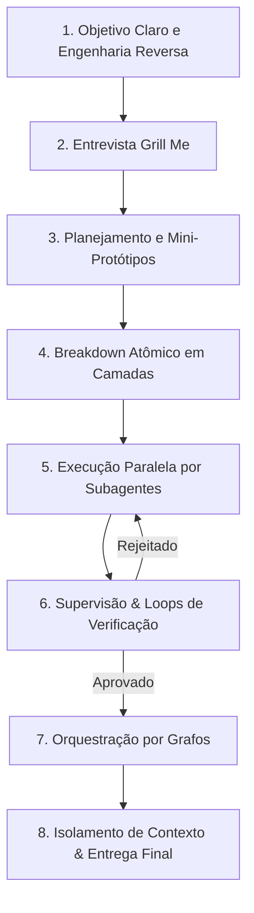

# Desenvolvimento com IA: Do Amador ao Profissional (Metodologia Agêntica)

> "Saber escrever um bom prompt hoje representa menos de 2% do necessário para extrair resultados excepcionais de modelos modernos. Amadores escrevem prompts em um chat; profissionais projetam arquiteturas de sistemas agênticos."

---

## 1. A Mudança de Paradigma

| Nível | Abordagem | Fluxo Típico | Limitação |
| :--- | :--- | :--- | :--- |
| **Amador** | *Prompting Direto* | Digita prompt → Aguarda resposta → Aceita o resultado | Alucinações, perda de contexto, código frágil, retrabalho massivo |
| **Profissional** | *Arquiteto Agêntico* | Engenharia reversa do objetivo final → Entrevista de requisitos → Plano revisado → Subagentes isolados em grafo → Supervisão contínua | Alta previsibilidade, escalabilidade, contexto limpo e código robusto |

---

## 2. Quando Usar Cada Abordagem

* **Chat Direto (Prompt Simples):** Apenas para tarefas cotidianas de baixa complexidade (correção rápida de sintaxe, tradução pontual, reformulação de texto).
* **Fluxo Agêntico Estruturado (Sistemas & Grafos):** Indispensável para projetos reais (aplicativos, SaaS, websites, ferramentas CLI, automações e sistemas com IA).

---

## 3. O Passo a Passo Inegociável (8 Etapas)



### 1. Definição da Meta (Objetivo Claro)
* Parta do **resultado final desejado** e faça engenharia reversa.
* Defina o critério exato de "pronto" antes de gerar a primeira linha de código ou instrução de execução.

### 2. Entrevista de Esclarecimento (Fase "Grill Me")
* Nunca deixe a IA assumir premissas arbitrárias sobre o projeto.
* Instrua a IA a **entrevistar você** minuciosamente com perguntas técnicas e de negócio até que toda ambiguidade seja eliminada.

### 3. Planejamento, Revisão e Mini-Protótipos
* **Regra de ouro:** *Corrija no plano, nunca na execução.* Alterar texto no planejamento consome centavos e protege a janela de contexto; consertar código já construído consome fortunas e degrada o projeto.
* Crie mini-templates leves (ex: HTML/CSS puros ou o comando `/design` do Claude Code para gerar 3 variações visuais de paleta e tipografia) antes do build definitivo.

### 4. Breakdown Atômico em Camadas
* Divida o plano em mini-tarefas independentes e desacopladas:
  * Camada de dados / banco
  * Camada de lógica / backend
  * Camada de interface / frontend

### 5. Execução Paralela por Subagentes
* Subagentes especializados atuam simultaneamente em suas frentes, sem sobreposição de arquivos ou responsabilidades cruzadas para evitar sobrescritas acidentais.

### 6. Camada de Supervisão & Loops de Verificação (Gauntlet Loops)
* A qualidade final depende do rigor do **Supervisor**, não do prompt inicial.
* O entregável de cada subagente é inspecionado contra critérios rígidos de aceitação. Se não passar, é rejeitado com feedback objetivo e retorna ao executor em ciclos contínuos de correção.

### 7. Orquestração por Grafos (Dependências Encadeadas)
* Como construir uma casa (*Fundação → Paredes → Telhado*): o resultado validado e sintetizado de uma etapa serve estritamente de insumo (*input*) para o início da fase seguinte.

### 8. Isolamento de Contexto & Entrega Final
* Isole as execuções em janelas de contexto enxutas e descartáveis. 
* Dividir o trabalho em dezenas de contextos menores impede que a IA sofra com esquecimento ou alucinações por sobrecarga.

---

## 4. As 6 Regras de Ouro do Desenvolvedor com IA

1. **Prompting é menos de 2%:** O verdadeiro valor está na arquitetura do sistema agêntico e no encadeamento dos papéis.
2. **Corrija no plano, nunca no código:** Nunca deixe o agente codificar sem antes aprovar um plano estruturado e conciso.
3. **Proteja a janela de contexto com isolamento:** Não utilize um único chat longo para tudo; resete contextos e delegue tarefas atômicas a subagentes.
4. **Invista nas métricas do Supervisor:** Critérios de verificação estritos geram código de qualidade; instruções vagas geram código medíocre.
5. **Isole o paralelismo:** Subagentes paralelos devem sempre operar em arquivos, camadas ou módulos isolados.
6. **Calibre a ferramenta pela complexidade:** Não use fluxo agêntico para mudar uma frase, e nunca use chat simples para construir um software complexo.

---

## 5. Templates Práticos para Copiar e Usar

### Template 1: Prompt de Entrevista ("Grill Me")
```text
Atue como meu Arquiteto de Software Principal. Meu objetivo é construir [DESCREVA O OBJETIVO DO PROJETO].
Antes de gerar qualquer plano ou código, faça uma entrevista comigo (técnica "Grill Me").
Faça de 3 a 5 perguntas pontuais e cruciais sobre arquitetura, requisitos de usuário, restrições técnicas, design e critérios de sucesso para que não reste nenhuma ambiguidade ou decisão arbitrária da sua parte.
Aguarde minhas respostas antes de prosseguir.
```

### Template 2: Prompt para Agente Supervisor / Revisor
```text
Atue como um Revisor de Código e Arquiteto Sênior extremamente rigoroso.
Avalie o entregável a seguir contra os seguintes critérios inegociáveis:
1. Conformidade total com os requisitos especificados.
2. Modularidade e separação de responsabilidades (Clean Code).
3. Ausência de dados mockados temporários ou gambiarras.
4. Robustez no tratamento de erros.

Se qualquer critério for violado, REJEITE a entrega, aponte os erros exatos e informe o que deve ser corrigido. Só aprove quando estiver 100% aderente aos padrões.
```

---

## 6. Checklist de Bolso para Novos Projetos

- [ ] Objetivo final e critérios de sucesso definidos por engenharia reversa
- [ ] Rodada "Grill Me" concluída (requisitos esclarecidos)
- [ ] Plano de implementação em texto revisado e aprovado
- [ ] Protótipo rápido ou variações visuais validados
- [ ] Tarefas fatiadas em camadas atômicas
- [ ] Subagentes alocados sem colisão de arquivos
- [ ] Critérios do supervisor estabelecidos e validados
- [ ] Contextos isolados por etapa do grafo

---

## Relações

### Relacionado a
- [[Segundo Cérebro]]
- [[Ferramentas-Internas]]
- [[Metodologias]]
