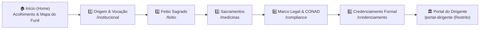

# 🧭 Funil Didático de Conversão Litúrgica & Arquitetura de Navegação

Esta nota documenta a estrutura do **Funil Didático de 5 Estações**, a política de desduplicação de conteúdo e as diretrizes de jornada do visitante no portal institucional da **Cooperativa Etnobotânica Nativaram**.

---

## 🎯 Objetivo Fundamental do Portal

O portal público da Cooperativa Nativaram sob a Lei 5.764/1971 e a Resolução CONAD nº 01/2010 **não é um e-commerce**. Seu propósito exclusivo é acolher dirigentes de igrejas, templos e comunidades tradicionais, esclarecer a procedência e pureza da medicina sagrada e convertê-los em **Instituições Credenciadas e Homologadas** (`/credenciamento`).

Para evitar a sobrecarga cognitiva e a "fadiga enciclopédica" (onde cada página tentava ser um livro completo e repetia o conteúdo das outras), o portal adota a **Regra da Singularidade Funcional**: cada aba do funil possui um propósito único e indispensável.

---

## 🗺️ As 5 Estações do Funil Didático

### Detalhamento das Estações:

| Estação | Rota | Foco Exclusivo (Sem Redundância) | Próximo Passo (`JornadaNextStep`) |
| :--- | :--- | :--- | :--- |
| **0. Boas-Vindas** | `/` | Acolhimento institucional, pilares sagrados, apresentação do mapa do funil, depoimentos e FAQ rápido. | Iniciar Jornada $\rightarrow$ `/institucional` |
| **1. Origem & Vocação** | `/institucional` | Gênese "Nascidos do Raio de Sol", identidade cooperativa sem fins lucrativos (Lei 5.764/71), deontologia e valores. | Avançar para Feitio $\rightarrow$ `/feitio` |
| **2. Feitio Sagrado** | `/feitio` | Alquimia em Cruzeiro do Sul/AC: Cipó Tucunacá e Folha Chacrona, proporção 60/40, caldeirões, decocção e purismo sem anayahuascas. | Avançar para Sacramentos $\rightarrow$ `/medicinas` |
| **3. Sacramentos** | `/medicinas` | Apresentação transparente das 4 graduações de Ayahuasca (1.8 a 10.1 Wirapuru), 15 rapés sagrados e Sananga. Zero e-commerce. | Avançar para Marco Legal $\rightarrow$ `/compliance` |
| **4. Marco Legal** | `/compliance` | Blindagem jurídica sob o Art. 5º da CF/88, Lei 11.343/06, CONAD nº 01/2010 e triagem integrativa de saúde. | **Clímax do Funil** $\rightarrow$ `/credenciamento` |
| **5. Credenciamento** | `/credenciamento` | Destino final de conversão: formulário acolhedor de homologação de igrejas, templos e dirigentes com feedback em 48h. | Acesso liberado $\rightarrow$ `/portal-dirigente` |

---

## 🌿 Abas Complementares Especializadas (Fora da Linha Direta)

1. **`/projetos-de-luz` (Praxeologia Social & Agrofloresta):**
   - Página enxuta e nobre focada exclusivamente no impacto do superávit cooperativo:
     - Agrofloresta e plantio regenerativo consorciado de mudas no Acre;
     - Preservação da fauna e ninhos de Ararajuba no Vale do Juruá;
     - Acolhimento litúrgico gratuito a casas terapêuticas e pessoas vulneráveis;
     - Fundo fraterno de subsídio logístico para pequenos templos do interior.
2. **`/estudos` (Biblioteca Científica Aberta):**
   - Dossiês botânicos, relatórios fitoquímicos e compêndios extraídos do Google NotebookLM em formato PDF.
3. **`/contato` (Atendimento Fraterno):**
   - Canal direto para esclarecimentos prévios de dirigentes antes do credenciamento.
4. **`/portal-dirigente` (Área Restrita):**
   - Acesso exclusivo e protegido por credenciais para dirigentes homologados e administração (`adm-nativaram` / `adm2026`).

---

## 🔒 Diretrizes de Governança e Anti-Inchaço

1. **Zero E-commerce:** Nunca reinserir botões de "comprar", "preço" ou "carrinho" nas páginas públicas.
2. **Zero Duplicação de Seções:** Detalhes de feitura pertencem a `/feitio`; debates de jurisprudência pertencem a `/compliance`; ações ambientais pertencem a `/projetos-de-luz`.
3. **Navegação Contínua:** Toda página do funil deve manter o componente `JornadaNavTracker` no topo e o `JornadaNextStep` no rodapé, permitindo leitura sequencial fluida com um único clique.

---

## ## Relações

### Depende de
- [[Indice-de-Recuperacao-Rapida]]
- [[Roadmap-e-Componentes-do-Site]]
- [[Portal-do-Dirigente-e-Gestao-Liturgica]]

### Relacionado a
- [[ADR-004-Assessoria-Liturgica-e-Documentos-A4]]
- [[Credenciamento-e-Homologacao-de-Templos]]
