# Plano Arquitetural: Decomposição Retrógrada (Backwards Design)
## Portal Institucional da Cooperativa Etnobotânica Nativaram Brasil

> **Status:** Aguardando Aprovação Manual do Usuário  
> **Metodologia:** Backwards Design (Decomposição Retrógrada orientada ao `CONTEXT.md`) + Mapeamento AST de Acoplamentos  
> **Papel:** Arquiteto de Sistemas de IA Profissional  

---

## 🔍 1. Diagnóstico da Varredura AST (Árvore de Sintaxe Abstrata)

Uma varredura estática de AST foi executada sobre os **87 arquivos TypeScript** (`.ts` e `.tsx`) de `src/` utilizando o compilador oficial da linguagem (`typescript` via `ts.createSourceFile`):

```text
=======================================================
   RELATÓRIO DA VARREDURA AST (ÁRVORE DE SINTAXE)
=======================================================
1. Distribuição por Camada:
   • Camada 'app' (Rotas e Páginas): 19 arquivos
   • Camada 'components' (UI & Apresentação): 54 arquivos
   • Camada 'lib' (Serviços, Banco e Validadores): 7 arquivos
   • Camada 'types' (Contratos TypeScript): 1 arquivo
   • Camada 'data' (Dicionários Canônicos e Fitoquímica): 6 arquivos

2. Violações de Acoplamento Vertical (Camadas Baixas -> Altas): ZERO (0)
   ✓ Arquitetura 100% limpa: lib/data/types não importam de components/ ou app/.

3. Hubs de Maior Centralidade (Fan-In Estático):
   • @/components/ui/AnimateOnScroll (26 importações)
   • @/components/ui/Badge (18 importações)
   • @/components/ui/Card (15 importações)
   • @/components/ui/SectionDivider (11 importações)
   • @/types/pedido (5 importações)
   • @/components/funil (5 importações)
   • @/data/graduacoes (5 importações)
   • @/lib/utils (5 importações)
=======================================================
```

---

## 🧭 2. Decomposição Retrógrada (Backwards Design)

A arquitetura do portal é projetada de trás para frente, partindo da consagração do valor para o usuário no ambiente de execução até a raiz do domínio:

```mermaid
graph TD
    classDef uiStyle fill:#16281E,stroke:#D4A359,stroke-width:2px,color:#F8F6F0;
    classDef apiStyle fill:#1C1917,stroke:#EAB308,stroke-width:2px,color:#F8F6F0;
    classDef srvStyle fill:#0F172A,stroke:#38BDF8,stroke-width:2px,color:#F8F6F0;
    classDef domStyle fill:#064E3B,stroke:#10B981,stroke-width:2px,color:#F8F6F0;

    subgraph Camada1 [CAMADA 1: Critério de Sucesso no Ambiente de Execução]
        UI1[Funil Didático de 5 Estações Públicas]:::uiStyle
        UI2[Portal do Dirigente: Solicitação & Acompanhamento]:::uiStyle
        UI3[Central de Documentos A4 & Farmacologia]:::uiStyle
        UI4[Painel de Gestão Central ADM]:::uiStyle
    end

    subgraph Camada2 [CAMADA 2: Contratos de API & Fronteiras HTTP]
        API1["GET /api/pedidos (Filtros & Métricas)"]:::apiStyle
        API2["POST /api/pedidos (Validação Zod & Protocolo)"]:::apiStyle
        API3["PATCH /api/pedidos/:id (Auth Guard & Status)"]:::apiStyle
        API4["DELETE /api/pedidos/:id (Auth Guard)"]:::apiStyle
        API5["GET /sacramentos (Canonical Alias Rewrite)"]:::apiStyle
    end

    subgraph Camada3 [CAMADA 3: Casos de Uso & Serviços da Aplicação]
        SRV1[RegistrarSolicitacaoPartilha]:::srvStyle
        SRV2[ConsultarSolicitacoesLiturgicas]:::srvStyle
        SRV3[AtualizarFaseCadeiaCustodia]:::srvStyle
        SRV4[CalcularParametrosWashoutLiturgico]:::srvStyle
        SRV5[GerarComprovanteWhatsApp]:::srvStyle
    end

    subgraph Camada4 [CAMADA 4: Entidades de Domínio & Persistência Pura]
        DOM1[Agregado SolicitacaoPartilha / Protocolo SOL]:::domStyle
        DOM2[Entidade TemploCredenciado / CONAD 01-2010]:::domStyle
        DOM3[Entidade SacramentoLiturgico / Graduações Tucunacá]:::domStyle
        DOM4[CadeiaDeCustodia: 5 Fases Litúrgicas]:::domStyle
        DB1[(Supabase PostgreSQL Remoto)]:::domStyle
        DB2[(Fallback Local JSON Atômico)]:::domStyle
    end

    Camada1 --> Camada2
    Camada2 --> Camada3
    Camada3 --> Camada4
```



---

### 🔹 CAMADA 1: Critério Final de Sucesso no Ambiente de Execução (Jornada E2E & Apresentação)
O critério de sucesso é a viabilização da **jornada cerimonial e da salvaguarda institucional** sem nenhuma fricção ou desvio regulatório.

1. **Jornada Didática Pública (5 Estações):**
   - Estação 1: `/institucional` (Origem, Aliança e Doutrina).
   - Estação 2: `/feitio` (Alquimia, Vigília no Fogo e Biomassa 60/40 em Cruzeiro do Sul/AC).
   - Estação 3: `/sacramentos` (As 4 graduações de Ayahuasca e 15 rapés sagrados tamponados).
   - Estação 4: `/compliance` (Blindagem CONAD nº 01/2010 e Marco ANVISA 2025).
   - Estação 5: `/credenciamento` (Adesão institucional e solicitação formal de homologação).
2. **Portal do Dirigente Litúrgico (`/portal-dirigente`):**
   - Acesso seguro via chave institucional (`NAT-TEMPLO-842`) ou Supabase Auth.
   - Solicitação de partilha com rateio cooperativo regressivo transparente (sem preço/carrinho).
   - Acompanhamento da cadeia de custódia com timeline de 5 fases e laudos HPLC.
   - Emissão instantânea de documentos canônicos em folha A4 (`@media print`), Word e Markdown.
3. **Painel do Conselho Gestor (ADM Master):**
   - Atualização de status e vinculação de lotes (`AC-2026-XX`) com disparo WhatsApp ao dirigente.

---

### 🔹 CAMADA 2: Contratos de API & Schemas (Fronteiras de Comunicação)
Regressivamente derivados para atender 100% das demandas da Camada 1:

- **`GET /api/pedidos`**:
  - *Query Params:* `temploId?: string`, `status?: StatusPedido | 'TODOS'`, `busca?: string`, `metricas?: boolean`.
  - *Resposta:* `{ sucesso: boolean, total: number, pedidos: PedidoLiturgico[], metricas?: MetricasPedidos }`.
- **`POST /api/pedidos`**:
  - *Payload (Validado via `NovoPedidoSchema`):* `temploId`, `temploNome`, `dirigenteNome`, `dirigenteTelefone`, `dirigenteEmail`, `cnpj`, `itens[]`, `dataCerimoniaPretendida`, `mensagemIntencao`.
  - *Resposta:* `{ sucesso: true, protocolo: string, pedido: PedidoLiturgico, whatsappUrl: string }`.
- **`PATCH /api/pedidos/[id]`**:
  - *Cabeçalho Obrigatório:* `x-nativaram-auth: ADMIN_SECRET_KEY`.
  - *Payload (Validado via `AtualizarPedidoSchema`):* `status`, `loteVinculado`, `codigoRastreio`, `previsaoEntrega`, `observacoesInternas`.
  - *Resposta:* `{ sucesso: true, pedido: PedidoLiturgico, whatsappNotificacaoUrl: string }`.
- **`GET /sacramentos`**:
  - Rewrite canônico transparente mapeado em `next.config.mjs` para `/medicinas`, erradicando a terminologia proibida da URL pública.

---

### 🔹 CAMADA 3: Casos de Uso & Serviços da Aplicação (Coordenação de Negócio)
Serviços puros e desacoplados de frameworks de apresentação:

1. **`RegistrarSolicitacaoPartilha` (`criarPedido`)**:
   - Valida idempotência e schema de entrada.
   - Gera identificador canônico `SOL-YYYY-XXXX`.
   - Executa persistência no banco Supabase com gravação atômica em disco (`data/pedidos.json.tmp` -> rename).
   - Retorna URL codificada para notificação via WhatsApp.
2. **`ConsultarSolicitacoesLiturgicas` (`obterTodosPedidos`)**:
   - Coordena a leitura com resiliência: se a conexão com PostgreSQL falhar, serve o catálogo local instantaneamente em zero downtime.
   - Aplica busca multi-termo (nome do dirigente, protocolo, sacramento, rastreio).
3. **`AtualizarFaseCadeiaCustodia` (`atualizarPedido`)**:
   - Valida autorização administrativa contra tempo de execução.
   - Registra transição no log auditável (`historico[]`).
   - Gera notificação de despacho refrigerado ao templo solicitante.
4. **`CalcularParametrosLiturgicos` (`calcularCinicaWashout`)**:
   - Aplica fórmulas farmacológicas de meia-vida ($5\text{ a }7 \times t_{1/2}$) e critérios de Hunter para contraindicações de Lítio e ISRS.

---

### 🔹 CAMADA 4: Entidades de Domínio Puras & Persistência (Core Sagrado)
Modelagem rigorosa das entidades imutáveis consolidadas no `CONTEXT.md`:

1. **Agregado `SolicitacaoPartilha` (`PedidoLiturgico`)**:
   - Protocolo litúrgico único.
   - Lista de cotas de sacramentos tradicionais.
   - Rateio cooperativo calculado (sem margem de lucro mercantil).
   - Intenção cerimonial e data pretendida.
2. **Entidade `TemploCredenciado`**:
   - Homologação sob a Resolução CONAD nº 01/2010.
   - Dados de pessoa jurídica religiosa (CNPJ, Dirigente Responsável, Comungantes).
3. **Entidade `SacramentoLiturgico`**:
   - Ayahuasca purista Tucunacá (3.1 Mainumbi, 5.1 Pituã, 7.1 Anhangatã, 10.1 Wirapuru).
   - Rapés Sagrados tradicionais (10 variedades tamponadas com pH alcalino de cinzas de Tsunu, Murici, Cumaru).
4. **Persistência Híbrida Resiliente**:
   - Nuvem: Supabase PostgreSQL (`pedidos_liturgicos`).
   - Air-gap / Local: `data/pedidos.json` com garantia ACID por renomeação atômica.

---

## 🛡️ 3. Padrões de Projeto & Guardrails de Qualidade

1. **Dicionário Semântico Rigoroso (`AGENTS.md`):** Bloqueio absoluto de termos médicos e comerciais em todas as camadas.
2. **Zero Secrets in Code:** Chaves administrativas consumidas estritamente de `process.env`.
3. **Singleton Memoizado:** Conexão Supabase reutilizada em memória para evitar overhead de rede.
4. **Test-Driven Loop:** Validação contínua através de `npm test` executado via `jiti` em menos de 1 segundo.
5. **Acessibilidade & Mobile First:** Suporte WCAG 2.1 AA, layouts responsivos e `@media print` para folhas A4.
